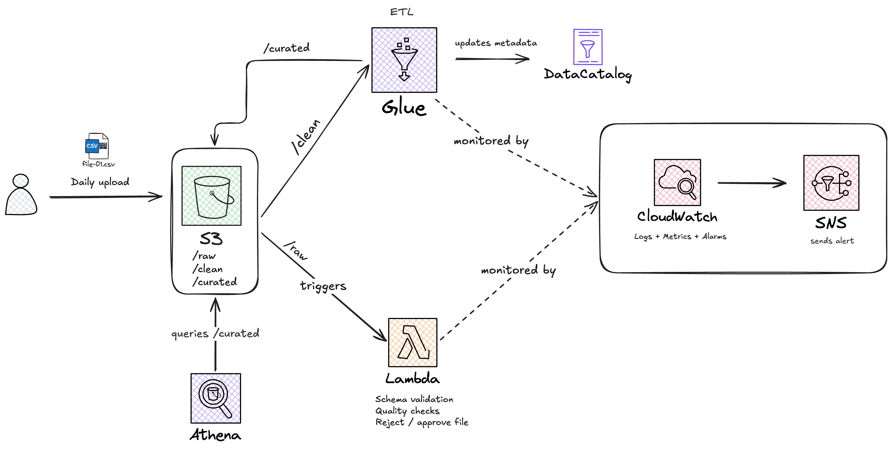
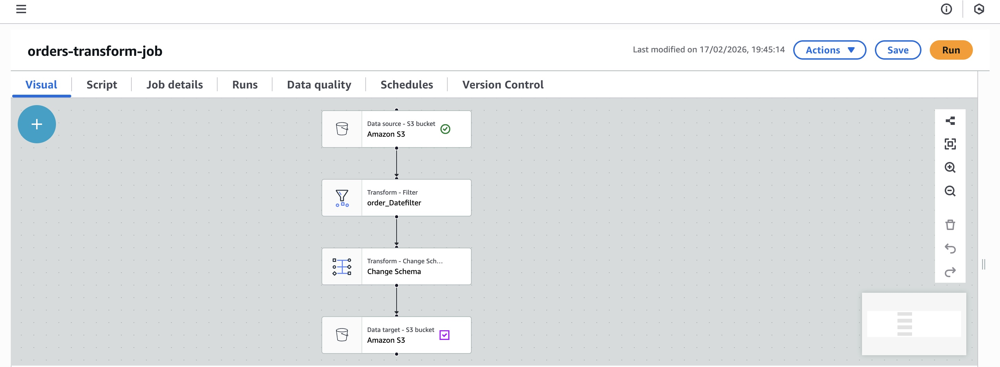

# AWS Serverless Orders Data Lake

Event-driven, serverless data pipeline for transactional order data using AWS.

---

## Architecture

**Stack:**
- S3 (raw → clean → curated)
- Lambda (validation gate)
- Glue Visual ETL (transform + Parquet + partition)
- Glue Data Catalog
- Athena (query layer)
- CloudWatch + SNS (monitoring + alerts)

---

## Design Philosophy

**1. Validate before compute**  
Corrupt or incomplete files are rejected at ingestion via Lambda to prevent wasted ETL resources and downstream contamination.

**2. Separate concerns**  
- Lambda → lightweight validation  
- Glue → transformation & partitioning  
- Athena → consumption layer  

Each layer has a single responsibility.

**3. Optimize for scale & cost**  
Curated data is written in Parquet and partitioned by `order_date` to enable partition pruning and reduce Athena scan costs.

**4. Observability by default**  
Lambda failures trigger CloudWatch alarms and automated SNS email notifications. No silent failures.

---

## How It Works

1. CSV uploaded to `raw/`
2. Lambda validates file (rejects empty/header-only data)
3. Valid files move to `clean/`
4. Glue transforms to partitioned Parquet in `curated/`
5. Data Catalog updated
6. Athena queries curated dataset
7. CloudWatch triggers SNS email on failure

No manual runs. No silent failures.

---

## Key Design Decisions

- **Validation before transformation** → prevents bad data from consuming compute
- **Partitioned Parquet storage (`order_date`)** → optimized for cost and query performance
- **Metadata-driven querying** → Athena reads from Glue Data Catalog
- **Alarm-based monitoring** → errors trigger email notifications automatically
- Fully serverless → no infrastructure management

---

## Glue Visual ETL

- Source: `clean/`
- Filter: non-empty `order_date`
- Output: Parquet
- Partition: `order_date`
- Catalog table: `orders_curated`

---

## Monitoring

Lambda error alarm:
- Condition: Errors > 0 (1 min window)
- Action: SNS email notification

### Cloudwatch Error

### Alert Email Received

---

## Scaling Considerations

At higher volumes:
- Tune Lambda memory and timeout
- Scale Glue DPUs
- Refine partition strategy

---

This project focuses on building reliable data systems — not just moving data, but enforcing quality, scalability, and observability from ingestion to analytics.
